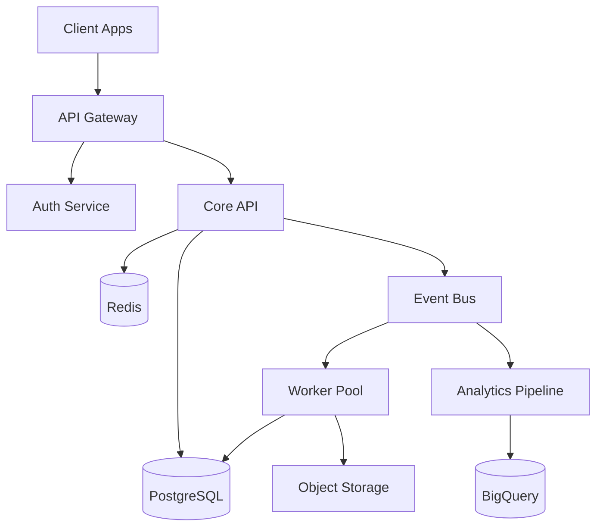
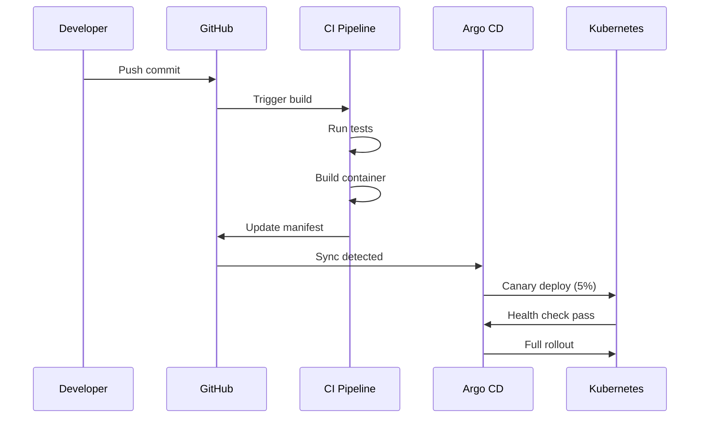

<!-- _class: title-hero -->
<!-- _paginate: skip -->

# System Architecture Overview

Vortex Platform -- Internal Engineering Review

Infrastructure Team -- February 2026

---

<!-- _class: bullets -->

## Tech Stack

- Application layer: Go microservices on Kubernetes (GKE)
  - gRPC for inter-service communication
  - REST + GraphQL for external API surface
- Data layer: PostgreSQL (Cloud SQL) + Redis + BigQuery
  - Event sourcing with Apache Kafka
  - Materialized views for read-heavy paths
- Infrastructure: Terraform, Argo CD, Prometheus, Grafana
  - Multi-region deployment across us-east1 and eu-west1
  - Zero-downtime deployments via canary rollouts

---

<!-- _class: two-col-wide-right -->

## Service Architecture

::: left

### Core Services

- **API Gateway** -- Rate limiting, auth, routing
- **Auth Service** -- OAuth2, SAML, API keys
- **Core API** -- Business logic and orchestration
- **Worker Pool** -- Async job processing
- **Event Bus** -- Kafka-based event streaming

:::

::: right

:::

---

<!-- _class: steps -->

## Request Lifecycle

1. **Client sends request** -- TLS-terminated at the load balancer, forwarded to the API Gateway which validates the JWT, enforces rate limits, and routes to the appropriate service

2. **Auth validation** -- The Auth Service verifies tokens against the session store in Redis, checks RBAC permissions, and attaches the user context to the request

3. **Business logic** -- The Core API processes the request, performs database operations within a transaction, and emits domain events to Kafka

4. **Async processing** -- Workers consume events from Kafka, handle side effects like sending notifications, updating search indices, and generating audit logs

---

<!-- _class: two-col -->

## Deployment Pipeline

::: left

### CI/CD Flow

A pull request triggers the full pipeline from build through production canary. Average time from merge to production is 12 minutes.

- Automated tests run on every PR
- Canary deploys to 5% of traffic
- Automatic rollback on error spike
- Full deploy after 15-minute soak

:::

::: right

:::

---

<!-- _class: stats-grid -->

## Performance Metrics

P99 Latency
**42ms**

Uptime (30d)
**99.997%**

Throughput
**28K rps**

Error Rate
**0.003%**

---

<!-- _class: bullets invert -->

## Security Considerations

- All data encrypted at rest (AES-256) and in transit (TLS 1.3)
  - Database-level encryption with customer-managed keys for enterprise tier
- Network segmentation via VPC Service Controls
  - Services communicate only through defined service mesh policies
  - No direct database access from public-facing services
- SOC 2 Type II and ISO 27001 certified
  - Quarterly penetration testing by independent third party
  - Automated vulnerability scanning in CI pipeline
- RBAC with principle of least privilege enforced at every layer
  - API keys scoped to specific resources and operations

---

<!-- _class: chapter -->

# Roadmap

What we are building next

---

<!-- _class: steps -->

## Upcoming Phases

1. **Q1 2026 -- Multi-region active-active** -- Deploy write-capable replicas in eu-west1 to serve European customers with sub-50ms latency and full data residency compliance

2. **Q2 2026 -- Event-driven architecture v2** -- Migrate from request-response patterns to a fully event-sourced model for the billing and notification subsystems

3. **Q3 2026 -- Edge compute layer** -- Deploy lightweight proxy workers at 40+ edge locations for static asset serving, request coalescing, and real-time personalization

4. **Q4 2026 -- Platform API GA** -- Open the internal service mesh to third-party developers with a self-serve portal, sandbox environments, and usage-based billing

---

<!-- _class: summary -->
<!-- _paginate: false -->

## Key Architectural Decisions

- Go microservices chosen for performance-critical paths over Node.js
- PostgreSQL as primary store for strong consistency guarantees
- Kafka over RabbitMQ for durability and replay capability
- gRPC internally for type safety and performance, REST externally for developer experience
- Multi-region from day one to avoid painful migration later
