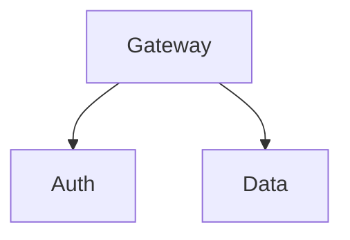

# Slide Layouts

Layouts control how content is arranged on a slide -- centered titles, bullet lists, two-column comparisons, full-bleed images, and more. Apply a layout with the `_class` directive in an HTML comment.

## Applying a Layout

Add `<!-- _class: layout-name -->` at the start of a slide:

```markdown
---

<!-- _class: title-hero -->

# Main Title
## Subtitle

**Speaker Name** -- Date

---
```

The `_class` directive is a standard Marp feature. It adds a CSS class to the `<section>` element for that slide.

## Available Layouts

AgentPreso provides 15 built-in layouts across six categories. All built-in themes support these layouts.

### Opening Slides

#### `title-hero`

Centered title slide with a distinct background. Use for the first slide.

```markdown
<!-- _class: title-hero -->

# Presentation Title
## Subtitle or Tagline

**Your Name** -- Date
```

#### `chapter`

Section divider with a large heading. Use to separate major sections.

```markdown
<!-- _class: chapter -->

# Part Two
## Diving Deeper
```

#### `full-bleed-title`

Title text over a full-bleed background image.

```markdown
<!-- _class: full-bleed-title -->

# Bold Statement


```

### Content Slides

#### `focus`

A single idea, centered. Use for key messages or transitions.

```markdown
<!-- _class: focus -->

## The most important thing to remember

is that simplicity wins.
```

#### `bullets`

Standard bullet list -- the workhorse layout.

```markdown
<!-- _class: bullets -->

## What We Learned

- First insight with supporting detail
- Second insight that builds on the first
- Third insight as the payoff
```

#### `steps`

Numbered sequence -- for processes, timelines, or ordered lists.

```markdown
<!-- _class: steps -->

## How It Works

1. Upload your markdown file
2. Choose a theme
3. Render to PDF or PPTX
4. Share with your team
```

#### `stats-grid`

A 2x2 grid of key metrics. Use for KPIs and dashboards.

```markdown
<!-- _class: stats-grid -->

## Q3 Performance

**$18.5M**
Revenue

**142%**
YoY Growth

**4.8/5**
Customer Rating

**99.9%**
Uptime
```

### Comparison Slides

#### `two-col`

Equal 50/50 split. Content before `::right::` goes left, content after goes right.

```markdown
<!-- _class: two-col -->

## Before vs After

::left::
### Before
- Manual processes
- 3-day turnaround
- Error-prone

::right::
### After
- Fully automated
- Real-time
- 99.9% accuracy
```

#### `two-col-wide-right`

1:2 ratio -- narrow left column, wide right column.

```markdown
<!-- _class: two-col-wide-right -->

## Architecture

::left::
### Components
- API Gateway
- Auth Service
- Data Layer

::right::

```

#### `three-col`

Equal thirds for comparing three items.

```markdown
<!-- _class: three-col -->

## Pricing Plans

::left::
### Free
- 5 decks
- 4 themes
- 10 renders/mo

::center::
### Pro
- Unlimited decks
- All themes
- 100 renders/mo

::right::
### Team
- Everything in Pro
- Shared workspace
- Priority support
```

### Media Slides

#### `img-right`

Content on the left, image on the right.

```markdown
<!-- _class: img-right -->

## Our Team

We're a distributed team of engineers
building the future of presentations.

- 12 engineers
- 4 designers
- 3 offices worldwide


```

#### `img-left`

Image on the left, content on the right.

```markdown
<!-- _class: img-left -->

## Product Demo


The new dashboard provides real-time
analytics and one-click exports.
```

#### `full-bleed`

Full-screen image with optional text overlay.

```markdown
<!-- _class: full-bleed -->


## Overlay Text Here
```

### Emphasis Slides

#### `quote`

Centered blockquote with decorative styling.

```markdown
<!-- _class: quote -->

> "The best presentations are the ones
> that feel like a conversation."
>
> -- Someone Wise
```

### Closing Slides

#### `summary`

Key takeaways displayed as a checklist. Use for the final content slide.

```markdown
<!-- _class: summary -->

## Key Takeaways

- Revenue grew 42% quarter-over-quarter
- Three new enterprise customers signed
- Platform reliability at 99.99%
- Hiring target exceeded by 20%
```

## Column Markers

The `::left::`, `::right::`, and `::center::` markers split content into columns. They work with `two-col`, `two-col-wide-right`, and `three-col` layouts.

Content before the first marker goes into a heading row that spans the full width. Content between markers fills each column.

## Tips

- **Don't overuse layouts** -- a mix of `bullets`, `two-col`, and a few visual slides makes a better deck than using every layout
- **Use `title-hero` for slide 1** and `summary` for the last slide -- this provides natural opening and closing structure
- **Match layout to content** -- use `stats-grid` for numbers, `quote` for testimonials, `img-right` when you have a supporting image
- **Plain slides are fine** -- a slide with just a heading and bullets (no `_class`) works well for most content
