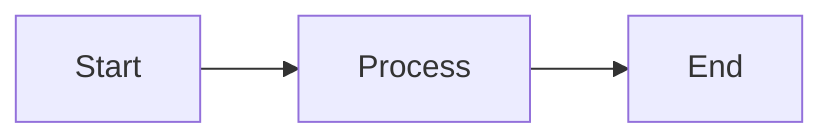

# AgentPreso

AI-native presentation platform. Create, edit, and render professional slide decks through natural conversation.

## Getting Started

### 1. Install the CLI

```bash
curl -fsSL https://agentpreso.com/install.sh | sh
```

Installs the `agentpreso` binary. Run `agentpreso update` later to get new versions.

### 2. Create an account

Sign up at **https://app.agentpreso.com/register**. An invite code is required during early access — run `agentpreso login` for details on how to request one.

### 3. Authenticate

```bash
agentpreso login
```

Prompts for email and password, then saves an API key locally. Verify with `agentpreso whoami`.

## Reading Strategy (for AI agents)

Read this file first. Only read additional docs when needed:
- Building a custom theme? → `docs/DESIGN-GUIDE.md`, then the Custom Themes section below
- Adding charts/diagrams? → the Charts and Diagrams section below
- Logo handling? → the Logos section below

Don't front-load all references — read them just-in-time.

## CLI Quick Reference

```bash
# Auth
agentpreso login                          # Authenticate
agentpreso whoami                         # Check current user

# Themes
agentpreso themes                         # List available themes
agentpreso themes show <name>             # Show theme details
agentpreso themes add <path>              # Upload custom theme directory
agentpreso themes update <name> theme.yaml  # Update theme from manifest
agentpreso themes update <name> --css f.css # Update raw CSS only
agentpreso themes delete <name>           # Delete custom theme

# Decks — local-first workflow
agentpreso new <file> -t <theme>          # Scaffold local markdown file
agentpreso push [file]                    # Push local file to cloud (creates or updates)
agentpreso pull <slug>                    # Download cloud deck to local file
agentpreso list                           # List cloud decks

# Rendering
agentpreso render <file> --format pdf     # Export to html, pdf, or pptx
agentpreso render <file> --var company="Acme" --vars data.yaml
agentpreso preview <file> -s 1            # Preview slide as PNG (for verification)
agentpreso serve <file>                   # Live preview server with hot reload

# Content generation
agentpreso add-graphic <slug> "prompt"    # AI-generate image into deck
agentpreso add-illustration <slug> --file drawing.yaml
agentpreso render-chart chart.yaml        # Render chart YAML to SVG
agentpreso render-diagram flow.mmd        # Render Mermaid to SVG

# Assets
agentpreso assets upload <file>           # Upload image for use in slides
agentpreso assets                         # List uploaded assets

# Sharing
agentpreso share <slug>                   # Generate public share link
agentpreso share <slug> --private         # Revoke public access
```

## Workflow

AgentPreso uses a **local-first** workflow: edit markdown files locally, push to cloud for rendering.

1. **Start**: `agentpreso themes` — pick a theme that matches the tone
2. **Create**: Write a `.md` file (see format below), or `agentpreso new deck.md -t corporate`
3. **Push**: `agentpreso push deck.md` — uploads to cloud, prints a **dashboard link** (requires login)
4. **Preview**: `agentpreso preview deck.md -s 1` — check each slide as PNG
5. **Iterate**: Edit the local file, re-push, re-preview until satisfied
6. **Deliver**: Always give the user the dashboard URL from `push` so they can view their slides
7. **Export**: `agentpreso render deck.md --format pdf` — check response for `warnings`
8. **Share** (optional, requires consent): Only if the user explicitly asks for a public link, run `agentpreso share deck-slug`. **You MUST ask the user for confirmation before sharing** — this creates a public URL accessible to anyone without authentication.

For cloud-only editing (no local file), use `agentpreso pull <slug>` to fetch, edit, then `agentpreso push`.

### Previewing Slides

Use `agentpreso preview <file> -s <n>` to render a single slide as PNG.
To review multiple slides, run preview for each slide index sequentially.
Always preview after push to verify charts, diagrams, and images rendered correctly.
If the preview shows a red error block, the chart/diagram has a syntax error — fix before continuing.

### Sharing

**WARNING: `agentpreso share` creates a PUBLIC link accessible to anyone without authentication. Never run this command without explicit user consent.** The presentation may contain confidential information.

To generate a share link (only after the user confirms they want a public link):

```bash
agentpreso share <deck-slug>
```

To revoke public access:

```bash
agentpreso share <deck-slug> --private
```

### Render Warnings

After rendering, check the response for `warnings`. If any chart, diagram, or image errors
occurred, they appear in the warnings array. Fix all warnings before sharing — they indicate
broken content in the rendered output.

## Markdown Format

Standard Marp-compatible markdown. Slides separated by `---`. Frontmatter sets theme and options:

```markdown
---
marp: true
theme: corporate
paginate: true
---

<!-- _paginate: skip -->

# Title Slide

---

## Content Slide

- Bullet points work naturally

---

<!-- _class: quote -->

> "Styled blockquote"
>
> — Attribution
```

### Pagination directives

| Directive | Effect |
|-----------|--------|
| `<!-- _paginate: false -->` | Hide page number |
| `<!-- _paginate: skip -->` | Hide and don't count (use on title) |
| `<!-- _paginate: hold -->` | Same number as previous slide |

### Slide Layouts

Apply with `<!-- _class: layout-name -->`:

**Opening & Closing**

| Layout | Use For |
|--------|---------|
| `title-hero` | Opening title slide |
| `chapter` | Section dividers |
| `full-bleed-title` | Title over full-bleed background image |
| `title-img` | Title slide with side image |
| `quote-hero` | Bold quote as opening/closing statement |
| `summary` | Key takeaways with checkmarks |
| `cta` | Call-to-action closing slide |

**Content**

| Layout | Use For |
|--------|---------|
| `bullets` | Standard bullet lists |
| `steps` | Numbered sequences |
| `focus` | Single key message, centered |
| `definition` | Term/definition pairs |
| `agenda` | Meeting or talk agenda |
| `cards` | Card grid for features or concepts |

**Media**

| Layout | Use For |
|--------|---------|
| `img-right` / `img-left` | Text + image split |
| `img-center` | Centered image with caption |
| `img-top` | Image above text content |
| `full-bleed` | Full-screen background image |
| `gallery` | Multi-image grid |
| `figure` | Wide visual (diagram/chart/image) with brief text |

**Data**

| Layout | Use For |
|--------|---------|
| `stats-grid` | 2x2 metric display |
| `stats-row` | Horizontal row of metrics |
| `big-number` | Single hero statistic |
| `timeline` | Horizontal sequence of events |

**Comparison**

| Layout | Use For |
|--------|---------|
| `two-col` | Side-by-side content |
| `two-col-wide-right` | Two columns, right side wider |
| `three-col` | Three equal columns |
| `before-after` | Before/after comparison |
| `pros-cons` | Pros and cons with icons |
| `matrix` | 2x2 grid of categories |

### Dark Mode Per-Slide

Add `invert` class to flip any slide to dark palette. Combine with layouts:

```markdown
<!-- _class: invert title-hero -->
# Dark Opening Slide
```

Charts, diagrams, and images auto-adapt to dark background.

### Images

Upload first, then reference by asset URI:

```markdown

```

### Logos

Use an existing logo file (SVG or PNG). Download it first if needed:

```bash
curl -o logo.png "https://example.com/logo.png"
agentpreso assets upload logo.png
```

Then reference via asset URI in slides, or attach to a theme:

```bash
agentpreso themes add ./my-theme/ --logo logo.svg
```

Do NOT attempt to reconstruct logos from HTML/CSS/JS extraction — use intact image files.

### Charts and Diagrams

````markdown
```chart
type: bar
data:
  labels: [Q1, Q2, Q3, Q4]
  datasets:
    - label: Revenue
      data: [10, 15, 12, 18]
```
````

````markdown

````

### Template Variables

Define defaults in frontmatter, override at render time:

```markdown
---
marp: true
agentpreso:
  theme: corporate
  vars:
    company: "Acme Corp"
    deal_size: "$500K"
---

# Proposal for {{company}}
Deal size: {{deal_size}}
```

Override: `agentpreso render deck.md --var company="Contoso" --var deal_size="$1.2M"`

Or from a file: `agentpreso render deck.md --vars overrides.yaml`

## Slide Design Principles

- **Every slide needs a visual** — chart, diagram, image, or graphic. No text-only slides.
- **Vary layouts** — don't repeat the same layout consecutively. Alternate between content, data, media, and comparison layouts to keep the deck visually dynamic.
- **One idea per slide** — split dense content across multiple slides.
- **Preview before done** — always check with `agentpreso preview` before declaring finished.

### Diagrams and Charts — Layout Rules

**Never combine bullet lists (>2 items) with diagrams or charts on the same slide.**
They compete for vertical space and the diagram overflows. The renderer will reject this with a 422 error.

| Visual scenario | Layout to use | Why |
|----------------|---------------|-----|
| Wide diagram + brief context | `figure` | Full-width visual with heading + 1-2 line description |
| Diagram alongside bullets | `two-col` | Visual in one column, bullets in the other |
| Full-width chart, minimal text | `figure` or no class | Heading + chart block fills the slide |
| Chart with detailed breakdown | `two-col` | Chart in one column, bullet legend in the other |

For detailed theme design guidance (color palettes, typography, CSS variables, logo placement), see [docs/DESIGN-GUIDE.md](./docs/DESIGN-GUIDE.md).

## Built-in Themes

| Theme | Style | Best For |
|-------|-------|----------|
| `agentpreso` | Modern | Navy warmth, tangerine accents — the default brand theme |
| `ink` | Editorial | Serif typography, newspaper red — reports, longform |
| `neon` | Cyberpunk | Cyan glow on near-black — product launches, tech keynotes |
| `terminal` | Retro | Green phosphor CRT — developer content, CLIs |
| `chalk` | Educational | Handwriting headings, teal — workshops, tutorials |
| `blueprint` | Technical | Grid overlay, engineering precision — architecture, specs |
| `ember` | Cinematic | Warm amber on dark — storytelling, brand narratives |
| `glacier` | Analytical | Cool blues, data-focused — dashboards, analytics |
| `botanica` | Organic | Forest green, gold serif — sustainability, luxury |
| `maison` | Luxury | Matte gold, minimalist — high-end proposals, fashion |

### Custom Themes

Create a directory with `theme.yaml` (required), optional `overrides.css` and `scaffold.md`, then:

> **Font limitation:** Only web-safe and Google Fonts render correctly. Proprietary fonts
> (e.g., CiscoSans, BrandFont) will fall back to system fonts. Use close alternatives:
> Inter, DM Sans, Source Sans Pro, etc.

#### Theme Customization Strategy

Use `theme.yaml` manifest options (colors, fonts, imagery) for all standard customization.
Do NOT create `overrides.css` unless the user explicitly requests styling that cannot be
achieved through `theme.yaml` parameters. The manifest covers colors, fonts, spacing,
imagery guidance, and layout preferences — `overrides.css` is a last-resort escape hatch,
not a default tool.

Usage:

```bash
agentpreso themes add ./my-theme/
agentpreso themes add ./my-theme/ --logo logo.svg --logo-position bottom-right --logo-size small
```

To update an existing theme, point to the theme.yaml file directly:

```bash
agentpreso themes update my-brand ./my-theme/theme.yaml
```

This re-assembles CSS from the manifest, auto-discovers `overrides.css` and logo files from the same directory, and updates the theme in-place (preserving logo asset IDs when logos haven't changed).
