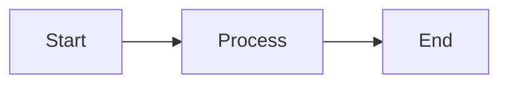

# AgentPreso

AI-native presentation platform. Create, edit, and render professional slide decks through natural conversation.

## Getting Started

### 1. Install the CLI

```bash
curl -fsSL https://agentpreso.com/install.sh | sh
```

Installs the `agentpreso` binary. Run `agentpreso update` later to get new versions.

### 2. Create an account

Sign up at **https://app.agentpreso.com/register**. An invite code is required during early access — run `agentpreso login` for details on how to request one.

### 3. Authenticate

```bash
agentpreso login
```

Prompts for email and password, then saves an API key locally. Verify with `agentpreso whoami`.

## Reading Strategy (for AI agents)

Read this file first. Only read additional docs when needed:
- Building a custom theme? → `docs/DESIGN-GUIDE.md`, then the Custom Themes section below
- Adding charts/diagrams? → the Charts and Diagrams section below
- Logo handling? → the Logos section below

Don't front-load all references — read them just-in-time.

## CLI Quick Reference

```bash
# Auth
agentpreso login                          # Authenticate
agentpreso whoami                         # Check current user

# Themes
agentpreso themes                         # List available themes
agentpreso themes show <name>             # Show theme details
agentpreso themes add <path>              # Upload custom theme directory
agentpreso themes update <name> theme.yaml  # Update theme from manifest
agentpreso themes update <name> --css f.css # Update raw CSS only
agentpreso themes delete <name>           # Delete custom theme

# Decks — local-first workflow
agentpreso new <file> -t <theme>          # Scaffold local markdown file
agentpreso push [file]                    # Push local file to cloud (creates or updates)
agentpreso pull <slug>                    # Download cloud deck to local file
agentpreso list                           # List cloud decks

# Rendering
agentpreso render <file> --format pdf     # Export to html, pdf, or pptx
agentpreso render <file> --var company="Acme" --vars data.yaml
agentpreso preview <file> -s 1            # Preview slide as PNG (for verification)
agentpreso serve <file>                   # Live preview server with hot reload

# Content generation
agentpreso add-graphic <slug> "prompt"    # AI-generate image into deck
agentpreso add-illustration <slug> --file drawing.yaml
agentpreso render-chart chart.yaml        # Render chart YAML to SVG
agentpreso render-diagram flow.mmd        # Render Mermaid to SVG

# Assets
agentpreso assets upload <file>           # Upload image for use in slides
agentpreso assets                         # List uploaded assets

# Sharing
agentpreso share <slug>                   # Generate public share link
agentpreso share <slug> --private         # Revoke public access
```

## Workflow

AgentPreso uses a **local-first** workflow: edit markdown files locally, push to cloud for rendering.

1. **Start**: `agentpreso themes` — pick a theme that matches the tone
2. **Create**: Write a `.md` file (see format below), or `agentpreso new deck.md -t corporate`
3. **Push**: `agentpreso push deck.md` — uploads to cloud, prints a **dashboard link** (requires login)
4. **Preview**: `agentpreso preview deck.md -s 1` — check each slide as PNG
5. **Iterate**: Edit the local file, re-push, re-preview until satisfied
6. **Deliver**: Always give the user the dashboard URL from `push` so they can view their slides
7. **Export**: `agentpreso render deck.md --format pdf` — check response for `warnings`
8. **Share** (optional, requires consent): Only if the user explicitly asks for a public link, run `agentpreso share deck-slug`. **You MUST ask the user for confirmation before sharing** — this creates a public URL accessible to anyone without authentication.

For cloud-only editing (no local file), use `agentpreso pull <slug>` to fetch, edit, then `agentpreso push`.

### Previewing Slides

Use `agentpreso preview <file> -s <n>` to render a single slide as PNG.
To review multiple slides, run preview for each slide index sequentially.
Always preview after push to verify charts, diagrams, and images rendered correctly.
If the preview shows a red error block, the chart/diagram has a syntax error — fix before continuing.

### Sharing

**WARNING: `agentpreso share` creates a PUBLIC link accessible to anyone without authentication. Never run this command without explicit user consent.** The presentation may contain confidential information.

To generate a share link (only after the user confirms they want a public link):

```bash
agentpreso share <deck-slug>
```

To revoke public access:

```bash
agentpreso share <deck-slug> --private
```

### Render Warnings

After rendering, check the response for `warnings`. If any chart, diagram, or image errors
occurred, they appear in the warnings array. Fix all warnings before sharing — they indicate
broken content in the rendered output.

## Markdown Format

Standard markdown. Slides separated by `---`. Deck-level frontmatter sets theme and options. Per-slide frontmatter sets layout and directives:

```markdown
---
theme: corporate
paginate: true
---

# Title Slide

---
layout: bullets
---

## Content Slide

- Bullet points work naturally

---
layout: quote
---

> "Styled blockquote"
>
> — Attribution
```

### Per-Slide Frontmatter

Each slide can have its own YAML frontmatter block (Slidev-style). The `layout` key maps to the slide's CSS class:

```markdown
---
layout: bullets
---

## My Bullets
- Point A
- Point B
```

Supported per-slide keys: `layout`, `class`, `transition`, `backgroundColor`, `backgroundImage`, `fragments`, `fragmentType`, `paginate`, `header`, `footer`, `color`, `style`.

The `layout` key is the primary way to set a slide's layout. Alternative: `<!-- _class: layout-name -->` (HTML comment syntax, still supported).

### Named Slots

For multi-column and container layouts, use `::name::` syntax to route content into named slots:

```markdown
---
layout: two-col
---

## Comparison

::left::
### Option A
- First benefit

::right::
### Option B
- Different benefit
```

Available slot names: `left`, `right`, `center`, `col`, `column`, `stat`. The `:::name ... :::` container syntax is also supported as an alternative.

### Pagination directives

| Directive | Effect |
|-----------|--------|
| `<!-- _paginate: false -->` | Hide page number |
| `<!-- _paginate: skip -->` | Hide and don't count (use on title) |
| `<!-- _paginate: hold -->` | Same number as previous slide |

These can also be set via per-slide frontmatter: `paginate: false`, `paginate: skip`, `paginate: hold`.

### Slide Layouts

Apply with per-slide frontmatter `layout: layout-name` (preferred) or `<!-- _class: layout-name -->`:

**Opening & Closing**

| Layout | Use For |
|--------|---------|
| `title-hero` | Opening title slide |
| `chapter` | Section dividers |
| `full-bleed-title` | Title over full-bleed background image |
| `title-img` | Title slide with side image |
| `quote-hero` | Bold quote as opening/closing statement |
| `summary` | Key takeaways with checkmarks |
| `cta` | Call-to-action closing slide |

**Content**

| Layout | Use For |
|--------|---------|
| `bullets` | Standard bullet lists |
| `steps` | Numbered sequences |
| `focus` | Single key message, centered |
| `definition` | Term/definition pairs |
| `agenda` | Meeting or talk agenda |
| `cards` | Card grid for features or concepts |
| `custom` | Blank canvas for agent-authored HTML with component classes |

**Media**

| Layout | Use For |
|--------|---------|
| `img-right` / `img-left` | Text + image split |
| `img-center` | Centered image with caption |
| `img-top` | Image above text content |
| `full-bleed` | Full-screen background image |
| `gallery` | Multi-image grid |
| `figure` | Wide visual (diagram/chart/image) with brief text |

**Data**

| Layout | Use For |
|--------|---------|
| `stats-grid` | 2x2 metric display |
| `stats-row` | Horizontal row of metrics |
| `big-number` | Single hero statistic |
| `timeline` | Horizontal sequence of events |

**Comparison**

| Layout | Use For |
|--------|---------|
| `two-col` | Side-by-side content |
| `two-col-wide-right` | Two columns, right side wider |
| `three-col` | Three equal columns |
| `before-after` | Before/after comparison |
| `pros-cons` | Pros and cons with icons |
| `matrix` | 2x2 grid of categories |

### Dark Mode Per-Slide

Add `invert` to flip any slide to dark palette. Combine with layouts:

```markdown
---
layout: invert title-hero
---

# Dark Opening Slide
```

Alternative syntax: `<!-- _class: invert title-hero -->`

Charts, diagrams, and images auto-adapt to dark background.

### Images

Upload first, then reference by asset URI:

```markdown

```

### Logos

Use an existing logo file (SVG or PNG). Download it first if needed:

```bash
curl -o logo.png "https://example.com/logo.png"
agentpreso assets upload logo.png
```

Then reference via asset URI in slides, or attach to a theme:

```bash
agentpreso themes add ./my-theme/ --logo logo.svg
```

Do NOT attempt to reconstruct logos from HTML/CSS/JS extraction — use intact image files.

### Charts and Diagrams

````markdown
```chart
type: bar
data:
  labels: [Q1, Q2, Q3, Q4]
  datasets:
    - label: Revenue
      data: [10, 15, 12, 18]
```
````

````markdown

```mermaid
graph LR
    A[Start] --> B[Process] --> C[End]
```
````

### Template Variables

Define defaults in frontmatter, override at render time:

```markdown
---
agentpreso:
  theme: corporate
  vars:
    company: "Acme Corp"
    deal_size: "$500K"
---

# Proposal for {{company}}
Deal size: {{deal_size}}
```

Override: `agentpreso render deck.md --var company="Contoso" --var deal_size="$1.2M"`

Or from a file: `agentpreso render deck.md --vars overrides.yaml`

## Slide Design Principles

- **Every slide needs visual structure** — use layouts, bold hierarchy, tables, callouts,
  and stats. Charts and images are powerful but not required on every slide.
- **One topic per slide** — but density is OK. A table + callouts + stats serving one topic
  is better than 3 sparse slides.
- **Match density to purpose** — board decks and data analysis should be information-dense.
  Keynotes and narratives should breathe. There's no single right density.
- **Create visual rhythm** — vary layouts, alternate dense and simple slides, mix data
  with narrative. Don't repeat the same layout three times in a row.
- **Bold text is your main tool** — `**bold**` renders in heading color in bullets, tables,
  and stats. Use it to create visual anchors that guide the eye.
- **Preview before done** — always check with `agentpreso preview` before declaring finished.

### Writing Beautiful Markdown

The CSS does heavy lifting — but only if you write markdown that gives it something
to work with. These patterns produce noticeably better slides:

**Bullet lists with bold titles:**
Lead each item with a bold phrase. The CSS renders the bold text in heading color, creating visual anchors:

```markdown
- **Revenue grew 42%** — driven by enterprise expansion and seat upgrades
- **Net retention hit 130%** — expansion outpacing churn 6:1
- **Gross margin at 94%** — infrastructure migration cut per-query cost 44%
```

**Nested bullets as descriptions:**
Sub-items render smaller in secondary color — like a title + description pattern:

```markdown
- **Revenue grew 42%**
  - Driven by enterprise expansion and seat upgrades across all segments
- **Net retention hit 130%**
  - Expansion outpacing churn 6:1, with enterprise NRR at 145%
```

**Tables with bold emphasis:**
Bold cells get heading color automatically. Use bold for the numbers you want to stand out:

```markdown
| Metric     | Q3      | Q4        | Change       |
|------------|---------|-----------|--------------|
| ARR        | $6.8M   | **$10.2M**| **+50%**     |
| Customers  | 380     | **528**   | **+39%**     |
```

**Blockquote callouts:**
Use blockquotes for contextual annotations. Lead with a bold title line:

```markdown
> **Revenue on track**
> Q4 exceeded forecast by 12%, driven by enterprise expansion.
```

**Stats with bold values:**
In `stats-grid` and `stats-row` layouts, bold text becomes the hero number:

```markdown
Revenue
**$10.2M**
```

### Data-Dense Slides

For board decks, financial reports, and analytical presentations, single-topic slides
with multiple components create the most professional output. Use `two-col` or
`three-col` layouts to combine:

- A **table** in one column showing the data
- **Callouts** in the other column providing context and interpretation
- **Stat boxes** summarizing key numbers

Example structure:

```markdown
---
layout: two-col
---
## Revenue by Segment

::left::
| Segment | ARR | Growth |
|---------|-----|--------|
| Enterprise | **$5.8M** | **+68%** |
| Mid-Market | $2.9M | +41% |
| SMB | $1.5M | +12% |

::right::
> **Enterprise is the growth engine**
> Average ACV doubled from $119K to $200K.

> **SMB churn needs attention**
> 4.2% quarterly — 16% annualized.
```

This produces a slide with a clean data table on the left and interpretive
callouts on the right — far more useful than splitting this across 3 slides.

### Custom HTML Slides

For layouts not covered by built-in options, use `layout: custom` with raw HTML.
The slide inherits theme variables but imposes no structural CSS.

**Prefer component classes over inline styles.** The base CSS includes pre-styled
components that work across all themes:

| Class | What it renders |
|-------|----------------|
| `.callout` + `.callout-success` / `-warning` / `-danger` / `-info` / `-primary` | Colored annotation box with title + body |
| `.stat-box` + `.stat-box-success` / `-warning` / `-danger` / `-info` / `-primary` | Bordered metric box with value + label |
| `.stat-box-value`, `.stat-box-label`, `.stat-box-detail` | Stat box inner elements |
| `.card` + `.card-title` | Container that can wrap tables, stats, callouts |
| `.bar-row` + `.bar-label` / `.bar-track` / `.bar-fill` / `.bar-value` | CSS-only horizontal bar chart |
| `.bar-fill-success` / `-warning` / `-danger` / `-info` | Bar fill color variants |
| `.summary-grid` + `.summary-item` / `.summary-total` | Row of big numbers with optional total |
| `.summary-item-value`, `.summary-item-label` | Summary grid inner elements |
| `.quadrant-grid` + `.quadrant` + `.quadrant-title` | 2x2 colored matrix |
| `.quadrant-success` / `-warning` / `-danger` / `-info` | Quadrant background variants |
| `.action-badge` + `.action-num` / `.action-text` / `.action-impact` | Numbered action items |

**Authoring priority:**
1. Standard markdown with a named layout (best — simplest, most portable)
2. `layout: custom` with component classes (good — structured, theme-aware)
3. `layout: custom` with inline styles and theme variables (acceptable — one-off designs)
4. `<style>` or `<script>` blocks (forbidden — stripped at render time)

**Semantic colors** available in all components and via inline styles:
`var(--color-success)`, `var(--color-warning)`, `var(--color-danger)`, `var(--color-info)`
— plus `-light` variants for backgrounds.

Example custom slide with components:

```html
---
layout: custom
---

<div style="display: grid; grid-template-columns: 3fr 2fr; gap: 2rem; height: 100%;">
  <div class="card">
    <div class="card-title">Revenue by Segment</div>
    <!-- markdown table or HTML table here -->
  </div>
  <div>
    <div class="callout callout-success">
      <h5>Enterprise is the engine</h5>
      <p>ACV doubled to $200K. Net retention at 145%.</p>
    </div>
    <div class="callout callout-warning" style="margin-top: 1rem;">
      <h5>SMB churn rising</h5>
      <p>4.2% quarterly churn — needs the Growth tier.</p>
    </div>
  </div>
</div>
```

### Diagrams and Charts — Layout Rules

**Be cautious mixing long lists with large visuals.** If a chart or diagram shares a slide with bullets, keep the list short (3-4 items max) and use `two-col` or `figure` layout to give each element room. The renderer will warn if content overflows.

| Visual scenario | Layout to use | Why |
|----------------|---------------|-----|
| Wide diagram + brief context | `figure` | Full-width visual with heading + 1-2 line description |
| Diagram alongside bullets | `two-col` | Visual in one column, bullets in the other |
| Full-width chart, minimal text | `figure` or no class | Heading + chart block fills the slide |
| Chart with detailed breakdown | `two-col` | Chart in one column, bullet legend in the other |

For detailed theme design guidance (color palettes, typography, CSS variables, logo placement), see [docs/DESIGN-GUIDE.md](./docs/DESIGN-GUIDE.md).

## Built-in Themes

| Theme | Style | Best For |
|-------|-------|----------|
| `agentpreso` | Modern | Navy warmth, tangerine accents — the default brand theme |
| `ink` | Editorial | Serif typography, newspaper red — reports, longform |
| `neon` | Cyberpunk | Cyan glow on near-black — product launches, tech keynotes |
| `terminal` | Retro | Green phosphor CRT — developer content, CLIs |
| `chalk` | Educational | Handwriting headings, teal — workshops, tutorials |
| `blueprint` | Technical | Grid overlay, engineering precision — architecture, specs |
| `ember` | Cinematic | Warm amber on dark — storytelling, brand narratives |
| `glacier` | Analytical | Cool blues, data-focused — dashboards, analytics |
| `botanica` | Organic | Forest green, gold serif — sustainability, luxury |
| `maison` | Luxury | Matte gold, minimalist — high-end proposals, fashion |

### Custom Themes

Create a directory with `theme.yaml` (required), optional `overrides.css` and `scaffold.md`, then:

> **Font limitation:** Only web-safe and Google Fonts render correctly. Proprietary fonts
> (e.g., CiscoSans, BrandFont) will fall back to system fonts. Use close alternatives:
> Inter, DM Sans, Source Sans Pro, etc.

#### Theme Customization Strategy

Use `theme.yaml` manifest options (colors, fonts, imagery) for all standard customization.
Do NOT create `overrides.css` unless the user explicitly requests styling that cannot be
achieved through `theme.yaml` parameters. The manifest covers colors, fonts, spacing,
imagery guidance, and layout preferences — `overrides.css` is a last-resort escape hatch,
not a default tool.

Usage:

```bash
agentpreso themes add ./my-theme/
agentpreso themes add ./my-theme/ --logo logo.svg --logo-position bottom-right --logo-size small
```

To update an existing theme, point to the theme.yaml file directly:

```bash
agentpreso themes update my-brand ./my-theme/theme.yaml
```

This re-assembles CSS from the manifest, auto-discovers `overrides.css` and logo files from the same directory, and updates the theme in-place (preserving logo asset IDs when logos haven't changed).
