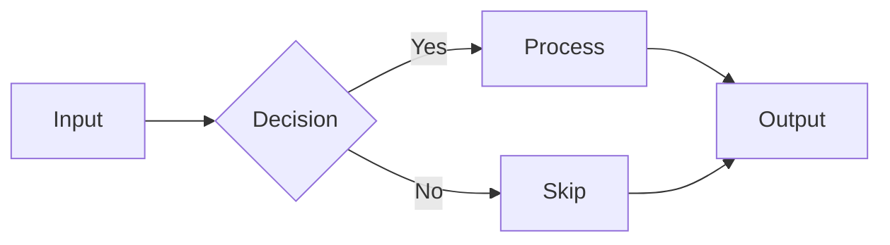
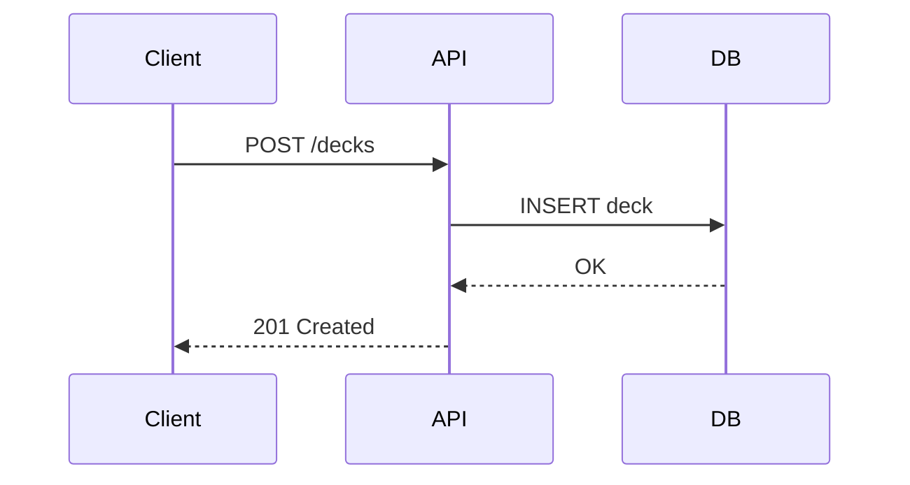

# How to Add Charts and Diagrams

AgentPreso renders charts and diagrams directly from code blocks in your markdown. No screenshots, no external tools — write the data inline and it renders on the slide.

## Adding a chart

Use a fenced code block with the `chart` language tag. Chart data is written in YAML.

### Simple chart (single series)

````markdown
```chart
type: bar
title: Sales by Quarter
data:
  labels: [Q1, Q2, Q3, Q4]
  values: [4.2, 5.1, 6.3, 7.8]
```
````

### Supported chart types

| Type | Description |
|------|-------------|
| `bar` | Vertical bar chart |
| `bar-horizontal` | Horizontal bar chart |
| `line` | Line chart with data points |
| `pie` | Pie chart (simple data only) |
| `donut` | Donut (ring) chart (simple data only) |

### Multiple series

Compare multiple data series using `x` for axis labels and `series` for the data:

````markdown
```chart
type: bar
data:
  x: [Q1, Q2, Q3, Q4]
  series:
    - name: Revenue
      data: [4.2, 5.1, 6.3, 7.8]
    - name: Costs
      data: [3.1, 3.5, 4.0, 4.2]
```
````

> **Alias:** You can also use `labels` instead of `x`, `datasets` instead of `series`, and `label` instead of `name`. Both formats are equivalent.

### Custom colors

Specify colors per series:

````markdown
```chart
type: line
data:
  x: [Jan, Feb, Mar, Apr, May]
  series:
    - name: Users
      data: [100, 150, 300, 450, 600]
      color: "#2563eb"
    - name: Sessions
      data: [200, 350, 500, 800, 1200]
      color: "#16a34a"
```
````

If you omit `color`, the chart uses your theme's color palette (primary, accent, secondary).

## Adding a diagram

Use a fenced code block with the `mermaid` language tag. AgentPreso renders [Mermaid](https://mermaid.js.org/) diagrams server-side as SVGs.

### Flowchart

````markdown

````

### Sequence diagram

````markdown

````

### Other supported diagram types

| Type | Mermaid syntax | Use case |
|------|---------------|----------|
| Flowchart | `graph TD` or `graph LR` | Processes, pipelines |
| Sequence | `sequenceDiagram` | API flows, interactions |
| Class | `classDiagram` | Data models |
| State | `stateDiagram-v2` | State machines |
| Gantt | `gantt` | Timelines, project plans |
| Entity Relationship | `erDiagram` | Database schemas |
| Pie | `pie` | Simple proportions |
| Mindmap | `mindmap` | Brainstorming |

### Theme integration

Diagrams automatically use your theme's colors. Mermaid inherits `--primary-color`, `--secondary-color`, and `--accent-color` from the active theme, so diagrams match the rest of your slides.

## Combining charts and diagrams with layouts

Charts and diagrams work in any layout. Place them alongside text using column layouts:

````markdown
<!-- _class: two-col -->

## Performance Overview

::: left

Our API response times improved 40% after the
infrastructure migration.

Key improvements:
- p50 latency: 45ms → 28ms
- p99 latency: 200ms → 120ms
:::

::: right

```chart
type: line
data:
  x: [Jan, Feb, Mar, Apr, May, Jun]
  series:
    - name: p50 (ms)
      data: [45, 42, 38, 32, 30, 28]
    - name: p99 (ms)
      data: [200, 180, 160, 140, 130, 120]
```
:::
````
