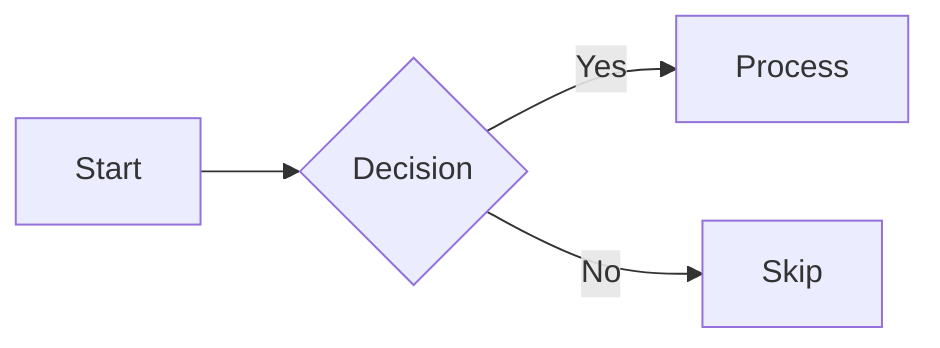

# Markdown Format Reference

AgentPreso presentations are single `.md` files using a superset of Marp markdown. This page documents the complete syntax.

## File Structure

```markdown
---
marp: true
agentpreso:
  theme: corporate
paginate: true
---

# First Slide

Content here

---

## Second Slide

More content
```

A deck is a YAML frontmatter block followed by slides separated by `---` (horizontal rules).

## Frontmatter

The YAML block between `---` markers at the top of the file:

```yaml
---
marp: true                    # Required -- enables Marp rendering
agentpreso:
  theme: corporate             # Theme name (default: minimal)
  brand:                      # Optional CSS variable overrides
    --primary-color: "#dc2626"
    --accent-color: "#f59e0b"
    --font-heading: "Georgia, serif"
  vars:                       # Optional template variable defaults
    company: "Acme Corp"
    quarter: "Q3 2025"
paginate: true                # Show slide numbers (Marp standard)
header: "Acme Corp"           # Header text on every slide (Marp standard)
footer: "Confidential"        # Footer text on every slide (Marp standard)
---
```

### `agentpreso.theme`

Name of the theme to apply. Resolves in this order:

1. User's custom themes (by name)
2. Built-in themes (by name)
3. Falls back to `minimal` if not found

### `agentpreso.brand`

CSS custom property overrides applied on top of the theme. Accepts an object of variable names and values:

```yaml
agentpreso:
  brand:
    --primary-color: "#0066cc"
    --font-body: "Helvetica, sans-serif"
```

See [./themes.md](./themes.md) for all available CSS variables.

### `agentpreso.vars`

Default values for `{{variable}}` placeholders. These are the lowest-priority source -- overridden by `--vars` files and `--var` flags at render time.

## Slide Separators

Slides are separated by `---` on its own line:

```markdown
# Slide One

Content

---

# Slide Two

More content
```

The first slide starts after the frontmatter closing `---`.

## Layout Directives

Apply a layout by adding `<!-- _class: layout-name -->` at the start of a slide:

```markdown
---

<!-- _class: title-hero -->

# Title Text
```

The `_class` directive is a standard Marp/Marpit feature. The underscore prefix means it applies to the current slide only (not all subsequent slides).

**Global directives** (without underscore) apply to all subsequent slides:

```markdown
<!-- class: bullets -->
```

### Available Layouts

| Layout | Category | Description |
|--------|----------|-------------|
| `title-hero` | Opening | Centered title with distinct background |
| `chapter` | Opening | Section divider with large heading |
| `full-bleed-title` | Opening | Title over a full-bleed background image |
| `focus` | Content | Single centered idea |
| `bullets` | Content | Standard bullet list |
| `steps` | Content | Numbered sequence |
| `stats-grid` | Content | 2x2 metric grid |
| `two-col` | Comparison | Equal 50/50 columns |
| `two-col-wide-right` | Comparison | 1:2 ratio columns |
| `three-col` | Comparison | Equal thirds |
| `img-right` | Media | Content left, image right |
| `img-left` | Media | Image left, content right |
| `full-bleed` | Media | Full-screen image |
| `quote` | Emphasis | Centered blockquote |
| `summary` | Closing | Checkmarked key takeaways |

See [./slide-layouts.md](./slide-layouts.md) for examples and usage guidance.

### Dark Mode with `invert`

Flip any slide to the theme's dark palette with `<!-- _class: invert -->`:

```markdown
---

<!-- _class: invert -->

## Dark Slide

Dark background, light text -- uses the theme's dark color palette.
```

Combine `invert` with any layout: `<!-- _class: invert bullets -->`.

All embedded content (charts, Mermaid diagrams, generated images) automatically adapts its colors to the slide's background mode.

## Column Markers

Split content into columns with `::left::`, `::right::`, and `::center::`:

```markdown
<!-- _class: two-col -->

## Heading (spans full width)

::left::
Left column content

::right::
Right column content
```

Content before the first marker becomes a heading row spanning all columns. Use with `two-col`, `two-col-wide-right`, and `three-col` layouts.

## Standard Markdown

All standard markdown is supported:

| Element | Syntax |
|---------|--------|
| **Bold** | `**text**` |
| *Italic* | `*text*` |
| `Code` | `` `code` `` |
| Links | `[text](url)` |
| Images | `` |
| Headings | `# H1` through `###### H6` |
| Bullet lists | `- item` or `* item` |
| Numbered lists | `1. item` |
| Blockquotes | `> quote` |
| Tables | Pipe-delimited rows |
| Horizontal rules | `---` (also a slide separator) |
| Code blocks | Triple backtick fences |

## Images

### Uploaded Assets

Upload files to R2 storage and reference them by URI:

```markdown

```

Upload via CLI (`agentpreso push` automatically uploads referenced assets), API (`POST /api/assets`), or MCP (`upload_asset`).

### Background Images

Use Marp's `bg` keyword in the alt text:

```markdown


```

| Keyword | Effect |
|---------|--------|
| `bg` | Full-bleed background, cover mode |
| `bg contain` | Background, scaled to fit |
| `bg right` | Image fills right half |
| `bg left` | Image fills left half |
| `bg left:40%` | Image fills left 40% |
| `bg right:60%` | Image fills right 60% |

## Charts

Fenced code blocks with the `chart` language tag:

````markdown
```chart
type: bar
data:
  labels: [Q1, Q2, Q3, Q4]
  datasets:
    - label: Revenue ($M)
      data: [4.2, 5.1, 6.3, 7.8]
      color: "#2563eb"
```
````

**Supported types:** `bar`, `line`, `pie`, `donut`, `area`, `stacked`

Chart data is YAML. Multiple datasets are supported. Colors default to the theme palette if omitted. `{{variable}}` placeholders are substituted inside chart blocks.

See [./charts-diagrams.md](./charts-diagrams.md) for full syntax.

## Diagrams

Fenced code blocks with the `mermaid` language tag:

````markdown

````

**Supported types:** flowchart (`graph`), sequence, class, state, gantt, ER, pie, mindmap.

Diagrams are rendered server-side as SVGs. Colors inherit from the active theme. `{{variable}}` placeholders are substituted inside mermaid blocks.

See [./charts-diagrams.md](./charts-diagrams.md) for examples.

## Template Variables

`{{variable}}` placeholders in the slide body are replaced at render time:

```markdown
# Proposal for {{company}}

Deal size: {{deal_size}}
```

### Where Substitution Applies

| Context | Substituted? |
|---------|-------------|
| Slide body text | Yes |
| `chart` code blocks | Yes |
| `mermaid` code blocks | Yes |
| `excalidraw` code blocks | Yes |
| Frontmatter (`---` block) | No |
| Regular code blocks | No |
| Inline code (backticks) | No |

### Syntax

| Pattern | Meaning |
|---------|---------|
| `{{name}}` | Simple variable lookup |
| `{{a.b.c}}` | Dot notation for nested objects |
| `\{{escaped}}` | Literal `{{escaped}}` -- not substituted |

### Variable Sources (priority order)

1. `--var` CLI flags (highest)
2. `--vars` YAML/JSON file
3. `agentpreso.vars` in frontmatter (lowest)

## Slide Numbers

Enable page numbers globally in frontmatter:

```yaml
---
marp: true
paginate: true
---
```

### Per-Slide Overrides

Control page numbers on individual slides with the `_paginate` directive:

```markdown
---

<!-- _paginate: false -->

# Title Slide

Page number hidden on this slide
```

| Directive | Effect |
|-----------|--------|
| `<!-- _paginate: false -->` | Hide the page number on this slide |
| `<!-- _paginate: skip -->` | Hide the page number AND don't count this slide in the total |
| `<!-- _paginate: hold -->` | Show the same page number as the previous slide |

**Common pattern:** Hide page numbers on title and closing slides:

```markdown
---
marp: true
paginate: true
---

<!-- _paginate: skip -->

# Welcome

Opening title -- no page number, not counted

---

## Slide One

Shows "1" in the corner

---

## Slide Two

Shows "2" in the corner

---

<!-- _paginate: false -->

# Thank You

Closing slide -- page number hidden
```

## Speaker Notes

Add speaker notes with Marp's HTML comment syntax:

```markdown
## Slide Title

Content visible to audience

<!--
Speaker notes go here.
Only visible in presenter mode.
-->
```

## Scoped Styles

Apply CSS to a single slide with Marp's `<style scoped>`:

```markdown
## Custom Styled Slide

<style scoped>
h2 { color: #dc2626; }
p { font-size: 1.2em; }
</style>

This slide has custom styling.
```
