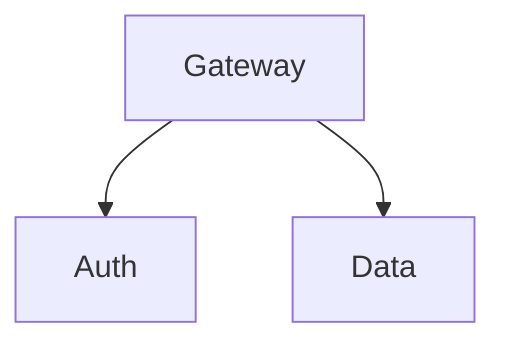
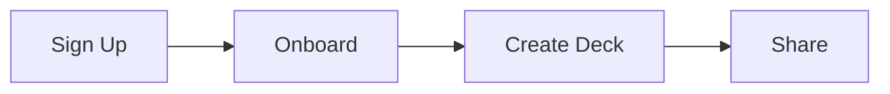

# How to Use Slide Layouts

Layouts control how content is arranged on a slide — centered titles, bullet lists, two-column comparisons, full-bleed images, and more. Apply a layout with the `_class` directive in an HTML comment.

## Applying a layout

Add `<!-- _class: layout-name -->` at the start of a slide:

```markdown
---

<!-- _class: title-hero -->

# Main Title
## Subtitle

**Speaker Name** — Date

---
```

The `_class` directive is a standard Marp feature. It adds a CSS class to the `<section>` element for that slide.

## Available layouts

AgentPreso provides 25 built-in layouts across six categories. All built-in themes support these layouts.

### Opening slides

#### `title-hero`
Centered title slide with a distinct background. Use for the first slide.

```markdown
<!-- _class: title-hero -->

# Presentation Title
## Subtitle or Tagline

**Your Name** — Date
```

#### `chapter`
Section divider with a large heading. Use to separate major sections.

```markdown
<!-- _class: chapter -->

# Part Two
## Diving Deeper
```

#### `full-bleed-title`
Title text over a full-bleed background image.

```markdown
<!-- _class: full-bleed-title -->

# Bold Statement


```

#### `title-img`
Title slide with a side image. Combines a hero title with a supporting visual.

```markdown
<!-- _class: title-img -->

# Product Launch
## Introducing Our New Platform


```

#### `quote-hero`
Bold quote as an opening or closing statement. Larger text than the standard `quote` layout.

```markdown
<!-- _class: quote-hero -->

> "The future belongs to those who prepare for it today."
>
> — Malcolm X
```

#### `cta`
Call-to-action closing slide. Use as the final slide to drive next steps.

```markdown
<!-- _class: cta -->

## Ready to Get Started?

Visit **agentpreso.com** to create your first deck.

hello@agentpreso.com
```

#### `summary`
Key takeaways displayed as a checklist. Use for the final content slide.

```markdown
<!-- _class: summary -->

## Key Takeaways

- Revenue grew 42% quarter-over-quarter
- Three new enterprise customers signed
- Platform reliability at 99.99%
- Hiring target exceeded by 20%
```

### Content slides

#### `focus`
A single idea, centered. Use for key messages or transitions.

```markdown
<!-- _class: focus -->

## The most important thing to remember

is that simplicity wins.
```

#### `bullets`
Standard bullet list — the workhorse layout.

```markdown
<!-- _class: bullets -->

## What We Learned

- First insight with supporting detail
- Second insight that builds on the first
- Third insight as the payoff
```

#### `steps`
Numbered sequence — for processes, timelines, or ordered lists.

```markdown
<!-- _class: steps -->

## How It Works

1. Upload your markdown file
2. Choose a theme
3. Render to PDF or PPTX
4. Share with your team
```

#### `definition`
Term/definition pairs. Use for glossaries, feature descriptions, or key concepts.

```markdown
<!-- _class: definition -->

## Core Concepts

**Deck**
A presentation stored as a single markdown file.

**Theme**
A reusable set of colors, fonts, and layout styles.

**Asset**
An image or file uploaded for use in presentations.
```

#### `agenda`
Meeting or talk agenda with structured items.

```markdown
<!-- _class: agenda -->

## Today's Agenda

1. Review Q3 results
2. Product roadmap update
3. Engineering hiring plan
4. Open discussion
```

#### `cards`
Card grid for features or concepts. Each card has a heading and description.

```markdown
<!-- _class: cards -->

## Platform Features

### Cloud Storage
Store and sync your decks across devices.

### AI Graphics
Generate custom illustrations from text prompts.

### Export
Render to PDF, PPTX, or shareable HTML.

### Themes
Professional themes with one-click application.
```

### Data slides

#### `stats-grid`
A 2x2 grid of key metrics. Use for KPIs and dashboards.

```markdown
<!-- _class: stats-grid -->

## Q3 Performance

**$18.5M**
Revenue

**142%**
YoY Growth

**4.8/5**
Customer Rating

**99.9%**
Uptime
```

#### `stats-row`
Horizontal row of metrics. Use when you have 3-5 stats to display in a single line.

```markdown
<!-- _class: stats-row -->

## At a Glance

**2,400+**
Active Users

**98%**
Satisfaction

**50ms**
Avg Response Time
```

#### `big-number`
Single hero statistic with supporting context. Use to highlight one key number.

```markdown
<!-- _class: big-number -->

## Revenue Growth

**142%**

Year-over-year increase driven by enterprise adoption
```

#### `timeline`
Horizontal sequence of events. Use for project milestones or history.

```markdown
<!-- _class: timeline -->

## Product Roadmap

**Q1 2026**
Launch beta

**Q2 2026**
Public release

**Q3 2026**
Enterprise features

**Q4 2026**
International expansion
```

### Comparison slides

#### `two-col`
Equal 50/50 split. Content before `::: right` goes left, content after goes right.

```markdown
<!-- _class: two-col -->

## Before vs After

::: left
### Before
- Manual processes
- 3-day turnaround
- Error-prone
:::

::: right
### After
- Fully automated
- Real-time
- 99.9% accuracy
:::
```

#### `two-col-wide-right`
1:2 ratio — narrow left column, wide right column.

```markdown
<!-- _class: two-col-wide-right -->

## Architecture

::: left
### Components
- API Gateway
- Auth Service
- Data Layer
:::

::: right

:::
```

#### `three-col`
Equal thirds for comparing three items.

```markdown
<!-- _class: three-col -->

## Pricing Plans

::: left
### Free
- 5 decks
- 4 themes
- 10 renders/mo
:::

::: center
### Pro
- Unlimited decks
- All themes
- 100 renders/mo
:::

::: right
### Team
- Everything in Pro
- Shared workspace
- Priority support
:::
```

#### `before-after`
Before/after comparison with visual distinction between the two states.

```markdown
<!-- _class: before-after -->

## Migration Impact

::: left
### Before
- Manual deploys
- 2-hour downtime
- No rollback
:::

::: right
### After
- CI/CD pipeline
- Zero-downtime
- Instant rollback
:::
```

#### `pros-cons`
Pros and cons with visual icons. Use for decision-making slides.

```markdown
<!-- _class: pros-cons -->

## Build vs Buy

::: left
### Pros
- Full control
- Custom features
- No vendor lock-in
:::

::: right
### Cons
- Higher upfront cost
- Longer timeline
- Maintenance burden
:::
```

#### `matrix`
2x2 grid of categories. Use for quadrant analysis or category breakdowns.

```markdown
<!-- _class: matrix -->

## Priority Matrix

::: left
### Urgent + Important
Ship critical bug fix

### Not Urgent + Important
Refactor auth system
:::

::: right
### Urgent + Not Important
Update dependencies

### Not Urgent + Not Important
Rename variables
:::
```

### Media slides

#### `img-right`
Content on the left, image on the right.

```markdown
<!-- _class: img-right -->

## Our Team

We're a distributed team of engineers
building the future of presentations.

- 12 engineers
- 4 designers
- 3 offices worldwide


```

#### `img-left`
Image on the left, content on the right.

```markdown
<!-- _class: img-left -->

## Product Demo


The new dashboard provides real-time
analytics and one-click exports.
```

#### `img-center`
Centered image with caption text above or below.

```markdown
<!-- _class: img-center -->

## System Architecture


*Figure 1: High-level system overview*
```

#### `img-top`
Image above text content. Use when the visual should be seen first.

```markdown
<!-- _class: img-top -->

## Dashboard Preview


The redesigned dashboard provides real-time metrics
and one-click export to PDF.
```

#### `full-bleed`
Full-screen image with optional text overlay.

```markdown
<!-- _class: full-bleed -->


## Overlay Text Here
```

#### `gallery`
Multi-image grid. Use for portfolios, screenshots, or photo collections.

```markdown
<!-- _class: gallery -->

## Product Screenshots


```

#### `figure`
Wide visual (diagram, chart, or image) with brief text. Visual-first layout with smaller heading, muted description, and a flex-growing container for the diagram or chart.

```markdown
<!-- _class: figure -->

## User Flow



*Complete user journey from registration to sharing*
```

### Emphasis slides

#### `quote`
Centered blockquote with decorative styling.

```markdown
<!-- _class: quote -->

> "The best presentations are the ones
> that feel like a conversation."
>
> — Someone Wise
```

## Layouts and column markers

The `::: left`, `::: right`, and `::: center` markers split content into columns. They work with `two-col`, `two-col-wide-right`, and `three-col` layouts.

Content before the first marker goes into a heading row that spans the full width. Content between markers fills each column.

## Dark mode per-slide

Add `invert` to flip any slide to its dark palette. Combine with layouts:

```markdown
<!-- _class: invert title-hero -->
# Dark Opening Slide
```

Charts, diagrams, and images auto-adapt to dark backgrounds.

## Tips

- **Don't overuse layouts** — a mix of `bullets`, `two-col`, and a few visual slides makes a better deck than using every layout
- **Use `title-hero` for slide 1** and `summary` for the last slide — this provides natural opening and closing structure
- **Match layout to content** — use `stats-grid` for numbers, `quote` for testimonials, `img-right` when you have a supporting image
- **Use `figure` for diagrams** — when a slide is primarily a diagram or chart with minimal text, `figure` gives it full width
- **Plain slides are fine** — a slide with just a heading and bullets (no `_class`) works well for most content
